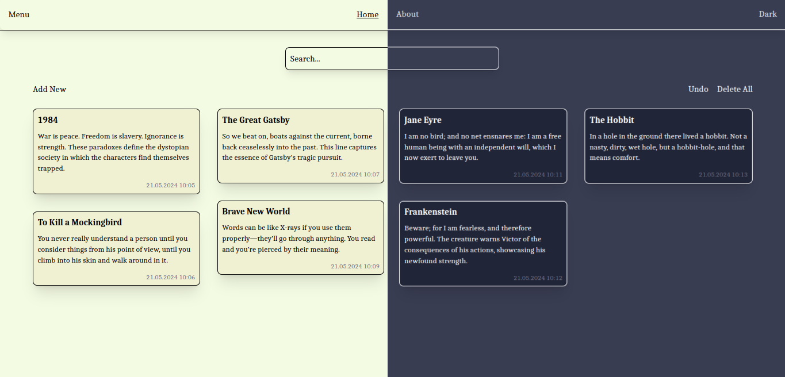

# textVerse

Responsive notes app built in Vue 3, TypeScript, Vite, Pinia. [Live Preview](https://textverse.web.app).

> This website was created as the final project for the [CS50x](https://https://cs50.harvard.edu/x/2024/) course.

### Features:
- Create, edit, and delete notes.
- Search notes.
- Download notes as .txt files.
- Light/dark theme.
- Create folders.
- Install as an app.